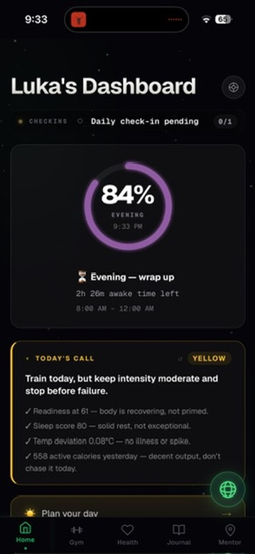
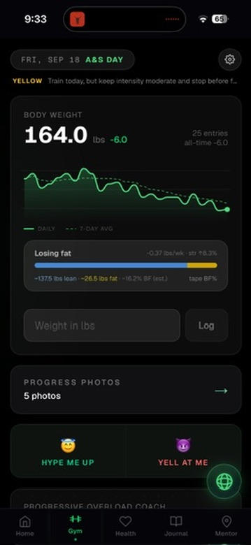
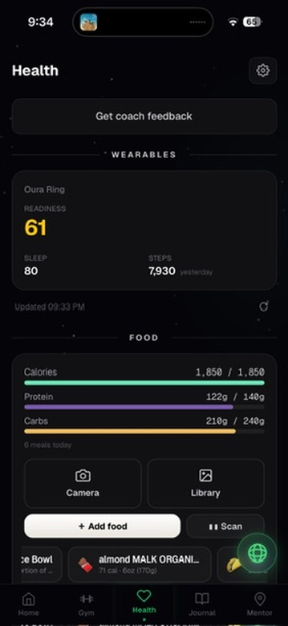
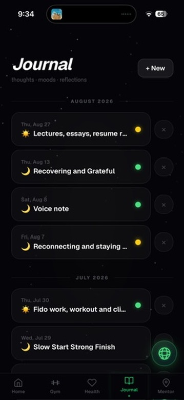
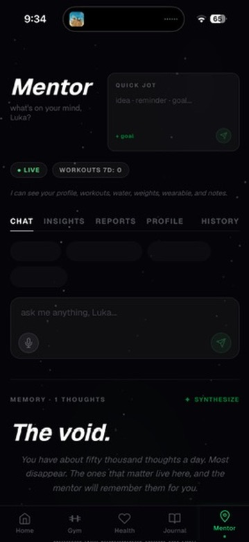

# Atlas

A personal life-operating-system built around the idea that the data you already generate every day should actually tell you something. Atlas pulls together training, sleep, nutrition, body composition and journaling into one dashboard, and then runs an AI coach across all of it that can answer questions like "why has my recovery been bad this week" using the actual numbers instead of generic advice.

Think of it as what a Whoop or Oura app would look like if it had Claude sitting behind it with access to everything, rather than a recovery score and a paragraph of boilerplate.

> **Status:** live in production and in daily use. Invite-only for a small group of family and friends, so there is no public signup.

<p align="center">
  
  
  
  
  
</p>
<p align="center"><sub>Home · Gym · Health · Journal · Mentor</sub></p>

---

## What it does

**Home** is a dashboard with an animated bento grid summarizing the day across every module, plus a morning and evening check-in, an activity snapshot, and a weekly AI-generated report.

**Gym** handles progressive overload tracking. Every set is logged individually, and the app computes your next prescription per exercise (hold, or step up) based on whether you cleared the top of your rep range. It also tracks estimated 1RM, best sets, session counts and volume trend per exercise, along with progress photos and tape measurements.

**Health** is the widest module. It syncs wearable data over OAuth from Oura, WHOOP or Fitbit (sleep, readiness, HRV, resting heart rate), logs food by photo or text or barcode with AI calorie estimation, and tracks water, caffeine, body weight and supplements with supply counts. An AI coach reads the whole picture and writes commentary on it.

**Journal** supports typed and voice entries with mood tracking, and Claude writes a reflection on each entry that you can then continue as a conversation thread.

**Mentor** is the cross-module coach. On every message it pulls training logs, wearable data, food, water, weight, journal entries, check-ins and health profile, so it can reason across domains and notice that your bad week of lifting lines up with three nights of poor sleep.

---

## Engineering notes

The parts of this project that were actually interesting to build.

**AI calorie estimation with an adaptive question loop.** Estimating calories from a photo is inherently imprecise, so rather than returning one number and pretending it is right, Atlas asks up to three follow-up questions, and only the ones that would move the estimate by more than 50 kcal. The questions are generated per-photo, the options are phrased in intuitive terms like "palm-sized" instead of gram weights, and every answer is re-fed to the vision model with the original image. Answers can be rewound and changed at any point, which required storing the full Q&A tree and supporting truncation on the server.

**Bring-your-own-key architecture.** Every user stores their own Anthropic and OpenAI keys rather than sharing a single project key. Keys are encrypted with AES-256-GCM before they touch the database, live in a table with RLS enabled and zero policies (so they are only reachable server-side), and the browser only ever receives the last four characters. There is deliberately no global env-var fallback anywhere in app code, which means a family member's runaway request can never quietly bill the account owner.

**Three wearable providers behind one interface.** Oura, WHOOP and Fitbit all normalize into a single shape at sync time, so every consumer in the app renders any of them without branching, and a single `wearableProvider.ts` module is the only place that knows which one is active. The interesting part was refusing to fake data: no Fitbit endpoint exposes a sleep score, so rather than inventing one that would contradict the number in the user's own Fitbit app, the field is published as null on purpose and the card falls back to showing hours slept. Fitbit also had to be re-pointed at the Google Health API after the legacy Fitbit Web API was retired, and WHOOP rotates its refresh token on every single refresh, which silently kills the connection if you persist only the access token.

**Two-client Supabase pattern.** `@supabase/ssr` still fires RLS even when handed a service role key, because it passes the cookie JWT along. Atlas therefore keeps two clients: an SSR client used exclusively for `auth.getUser()`, and a raw service client for every database operation. Per-user scoping is then enforced in application code on all 118 API routes, which were audited end to end for cross-user leaks.

**Streaming AI throughout.** Coach responses, journal reflections and mentor chat all stream token by token over NDJSON, with the client parsing incrementally so text appears as it is generated rather than after a multi-second wait.

**MCP server.** Atlas exposes its own Model Context Protocol server, so Claude can log food, water, supplements, weight and gym sets directly, or read back gym progress and daily summaries, without going through the UI.

**Mobile-first with real motion design.** Built as a PWA with a cosmic/nebula visual language, a Three.js starfield, orbiting module nodes on the home screen, and Framer Motion transitions throughout. A recurring lesson was that transformed ancestors break `position: fixed`, which is why every modal and overlay portals to `document.body`.

---

## Stack

| Layer | Choice |
|---|---|
| Framework | Next.js 16 (App Router), React 19, TypeScript |
| Styling | Tailwind CSS v4, Framer Motion, Three.js |
| Data | Supabase (Postgres, Auth, Storage, RLS), 48 migrations |
| Client state | TanStack Query v5 |
| AI | Anthropic Claude (coaching, reflection, mentor), OpenAI (food vision) |
| Integrations | Oura, WHOOP and Fitbit (OAuth), Apple Health (iOS Shortcuts), MCP |
| Hosting | Vercel |

Roughly 118 API routes, 16 pages, and 25 tables.

---

## Running it locally

```bash
git clone https://github.com/<your-username>/atlas.git
cd atlas
npm install
cp .env.example .env.local   # then fill in your own values
npm run dev
```

You will need a Supabase project with the migrations in `supabase/migrations/` applied through the SQL editor, since they are not auto-run. Anthropic and OpenAI keys are added per-user through the in-app settings page rather than through environment variables.

Atlas is built around one person's data model and habits, so it is shared here as a portfolio piece and a reference rather than as something designed to be deployed by others.

---

## License

MIT
